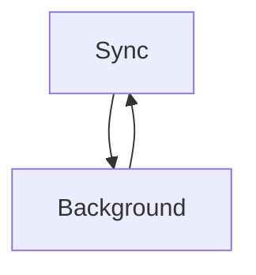
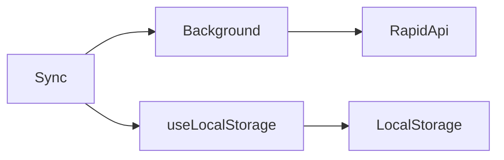
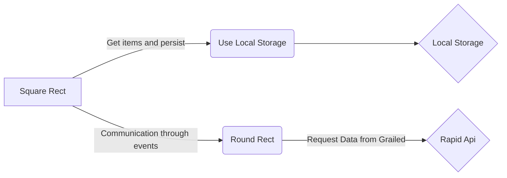

# Vendoo Technical Assessment

Howdy. I hope whoever is reading is doing well, Thank you for the opportunity.
Here I will explain my journey through this assessment, I separated 3 topics:

*  1- understanding the Grailed platform
*  2- understanding the code 
* 3- Creating my code

## 1 - understanding the Grailed platform
However, my first hurdle was deciding between finding a Grailed API or creating a simple web scrapper.
As long as Grailed doesn't have an open API and I don't know the terms of consent to create a web scraper legally, I went to plan B which was to find some platform that would provide me information from Grailed as soon as I assumed this platform can do it legally.
I found this API: https://rapidapi.com
Although I found an API, now my challenge was just beginning, I needed to understand how the data would return and how I could consume it.
> Request example: 
```shell
curl "https://grailed.p.rapidapi.com/search?query=shirt&page=1&hitsPerPage=32&sortBy=mostrecent" \
  -H "X-RapidAPI-Key: YOUR API KEY" \
  -H "X-RapidAPI-Host: grailed.p.rapidapi.com" \
  -G
```

## 2 - understanding the Grailed platform
With the final point in hand, I now need to understand the code and its flow.
After understanding all the code configurations and its flow, two files caught my attention, sync and background, but what the heck were these files?
### Sync:
Sync is the visual build page that will bring react to the google extension.
Now it's clear, its will receive the data and display in screen to user using react library.
### Background:
A background script in a Chrome extension is a critical component that runs in the background, separate from the web pages. It provides a central place for managing the extension's core logic and enables the extension to maintain state, perform tasks, or handle events.
### UML diagrams (Sync and Background Flow):


## 3- Creating my code
I broke this step into a few smalls steps to organize myself and complete it successfully.
- First, I created the synchronization and background communication through an event that listens when messages arrive and ensured that messages and parameters were being passed and retrieved correctly.
- Second, I created the request and verified that it was returning correctly.
- Third, I created the style and visual structure of the page.
- Fourth step I thought about the resource we were using and because it was an external API I didn't want to consume many requests as this could affect the cost and doesn't add much value to the end user, so I created a customized Hook that inserts information into local storage
- Fifth step, persist this information and guarantee that if it exists, I will use it to avoid unnecessary requests.
- Sixth step I created the pagination

### UML diagrams


Final solution flow chart:



# Instructionsto installation

To run this project, follow this steps:

  

1. Run `yarn install` or `npm i` (check your node version >= 16.6, recommended >= 18)

2. Run `yarn start` or `npm start`

3. Load Extension on Chrome

1. Open Chrome browser (or chrome based browsers)

2. Access `chrome://extensions`

3. Check "Developer mode" toggle (Top-right corner)

4. Click on "Load unpacked" extension

5. Select the `dist` folder in this project (after `yarn start` or `yarn run build`)

  

To build the extension, Just run `yarn build` or `npm run build`.

  

For this assessment, you can ignore the directories below, they won't be part of the assessment.

  

- ./utils

- ./test-utils

  

### Reference

  

Chrome extension messaging doc: https://developer.chrome.com/docs/extensions/mv3/messaging/

  

Chrome extension webrequests doc: https://developer.chrome.com/docs/extensions/reference/webRequest/

  

---

This project was based on https://github.com/Jonghakseo/chrome-extension-boilerplate-react-vite


  <h1 align="center"> Social Medias and Contact </h1>

  <div align="center" style="display: inline_block"> 
    <h4>GitHub: felipeimp22</h4>
  <a href="https://www.linkedin.com/in/felipeianazareth/" target="_blank"></a>
 <!-- <a href="https://www.instagram.com/felipeimp22/" target="_blank"></a> -->
  <a href = "mailto:felipeimperio.imperioo@gmail.com"></a>
  </div>

# Thanks